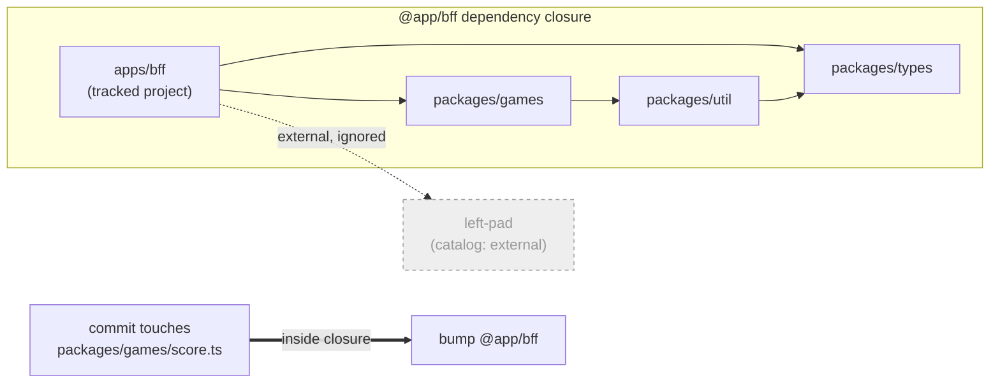
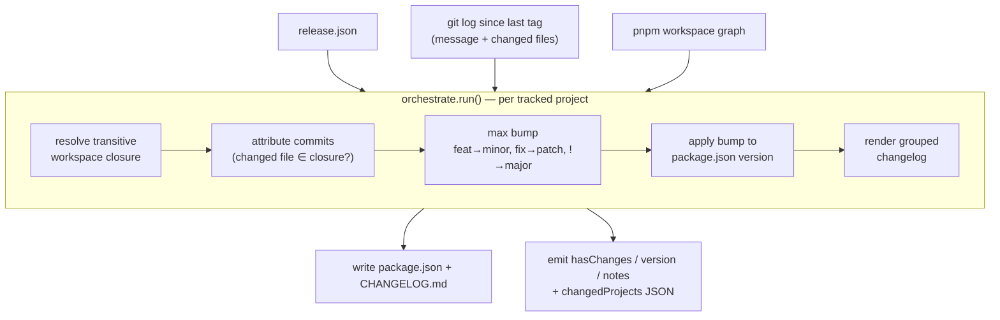
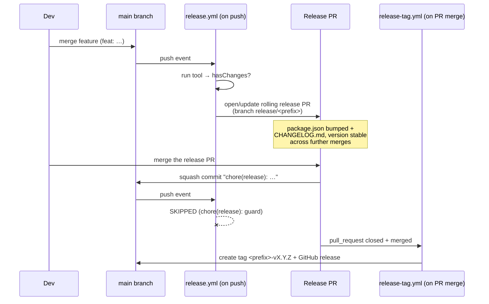
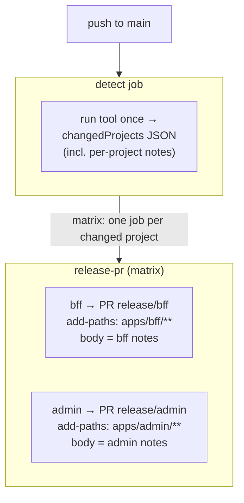
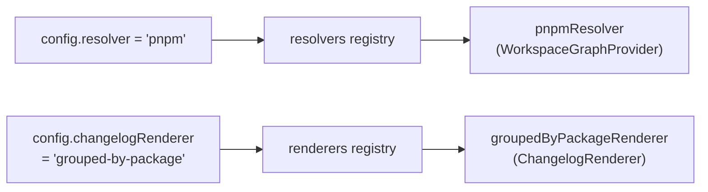

# Dependency-Aware Release Tool

Automated semantic versioning, changelogs, and release PRs for products in a pnpm
monorepo — where a change to a **bundled internal dependency** counts as a change to
the product that ships it.

Built for the case where a deployable app (e.g. a BFF) `esbuild`-bundles ~18 internal
`workspace:*` packages: when any of those packages changes, that code ships inside the
app, so the app's version must bump — automatically, with no manual changeset files and
no versioning forced onto the internal packages.

> Full rationale and the rejected-alternatives analysis live in
> [`DEP-AWARE-RELEASE-TOOL-DESIGN.md`](./DEP-AWARE-RELEASE-TOOL-DESIGN.md). Design decisions,
> verifications, and known gaps live in [`EXTENSIBILITY-DESIGN.md`](./EXTENSIBILITY-DESIGN.md).

---

## The core idea

A change to a bundled dependency is a change to the product. The tool walks the
`workspace:*` dependency closure of each tracked project and attributes commits by
**which folder they touched**, not by hand-written markers.



A commit touching `packages/games` bumps `@app/bff` because `games` is in its closure.
A commit touching the external `left-pad` does not.

---

## The pipeline (a pure function)

The tool is stateless: `(git history + dependency graph + config) → (version, changelog, edited files)`.
It writes files and prints outputs. It does **not** call the GitHub API or write tags —
that is the workflow's job.



State lives entirely in **git tags** (`<tagPrefix>-vX.Y.Z`). "Since last release" = since the
project's last matching tag. No manifest file to drift.

---

## GitHub lifecycle (two workflows)

The tool runs on every push to `main`. Tagging is a **separate** workflow that fires only
when a release PR merges. This split is what keeps versions stable (no drift) across repeated
merges.



**The race guard:** merging the release PR pushes to `main` *and* triggers the tag workflow.
The push workflow skips any `chore(release):` commit so it never re-bumps on top of an
un-tagged release commit. (Verified on real Actions — see `EXTENSIBILITY-DESIGN.md §5b/§5c`.)

---

## Multi-project releases

One tool run handles all tracked projects. Each project's files live under its own path,
so the push workflow uses a **matrix** to open one isolated PR per changed project.



A shared-dependency change bumps **every** dependent project (each gets its own PR). A change
to one project's own code bumps **only** that project. Each PR contains only its project's
files and renders its own grouped-by-package changelog as the PR body.

---

## Configuration

A `release.json` at the repo root:

```jsonc
{
  // Tracked projects: the deployables you want versioned. (required)
  "trackedProjects": [
    { "path": "apps/bff", "tagPrefix": "kc-bff" }
    // add more for multi-project; paths and tagPrefixes must be unique
  ],

  // Everything below is optional — defaults shown.
  "resolver": "pnpm",                    // dependency-graph resolver (registry key)
  "changelogRenderer": "grouped-by-package",
  "includeDev": false,                   // do devDependency edges count toward the closure?
  "commitTypes": {                       // conventional type → bump (breaking ! / footer → major)
    "feat": "minor",
    "fix": "patch",
    "perf": "patch",
    "refactor": "patch",
    "revert": "patch"
  }
}
```

Config is validated on load and fails loud: missing/empty `trackedProjects`, duplicate
`tagPrefix` or `path`, invalid bump values, and malformed JSON are all rejected.

---

## CLI

Run via Node 22+ (the tool is TypeScript run directly; no build step):

```bash
# Compute releases, write package.json + CHANGELOG.md, emit outputs.
node ./src/cli.ts --repo-root "$REPO"

# Compute + emit outputs WITHOUT writing any files.
node ./src/cli.ts --repo-root "$REPO" --dry-run

# Custom config location (default: <repo-root>/release.json).
node ./src/cli.ts --repo-root "$REPO" --config release.config.json

# Print a tracked project's path for a tagPrefix (used by the tag workflow).
node ./src/cli.ts resolve-path kc-bff --repo-root "$REPO"
```

### Outputs (stdout + `$GITHUB_OUTPUT`)

| Key | Meaning |
|-----|---------|
| `hasChanges` | `true` if any tracked project needs a release |
| `changedProjects` | JSON array `[{ tagPrefix, path, version, notes }]` — drives the workflow matrix |
| `<prefix>_version` | computed next version for a changed project |
| `<prefix>_notes` | changelog notes for a changed project (heredoc form) |

---

## Extensibility

Two seams, each selected by a name in config and resolved from a registry. v1 ships one
built-in for each; "going public" later means external code calling `.register()` — no
interface change.



- **`WorkspaceGraphProvider`** — reports the raw internal workspace graph (per package: dir +
  direct prod/dev internal deps). The transitive closure + prod/dev policy is **shared** code,
  so every package manager computes identical closures. v1: `pnpm`.
- **`ChangelogRenderer`** — turns a computed release into notes text. v1: `grouped-by-package`.

A shared `ReleaseContext` (immutable; capability interfaces like `git`, `logger`) is passed to
both seams.

---

## Project layout

```
src/
  cli.ts            CLI shell (arg parsing, IO)
  orchestrate.ts    runs the pipeline per project
  config.ts         load + validate release.json
  git.ts            GitReader (log since tag, lastTag) — verified git output formats
  closure.ts        shared, cycle-safe transitive closure (NOT a seam)
  attribution.ts    commit changed-paths ∩ project closure
  commit.ts         conventional-commit parsing
  bump.ts           max-bump + semver apply
  release.ts        computeRelease (pure)
  writers.ts        write package.json + CHANGELOG.md
  outputs.ts        build GITHUB_OUTPUT block
  registry.ts       name → built-in
  builtins.ts       registers pnpm resolver + grouped renderer
  resolvers/pnpm.ts WorkspaceGraphProvider (pnpm)
  renderers/grouped-by-package.ts  ChangelogRenderer
  types.ts          contracts
.github/workflows/
  release.yml       push → tool → rolling PR (matrix per project)
  release-tag.yml   release-PR merge → create tag + release
```

## Development

```bash
pnpm install
pnpm test        # node --test (78 tests)
pnpm typecheck   # tsc --noEmit
pnpm coverage    # tests + coverage (src is ~100% line/func)
```

---

## Status & known limitations

Validated end-to-end on real GitHub (single- and multi-project) in a sandbox pnpm workspace.
Honest gaps, tracked in `EXTENSIBILITY-DESIGN.md`:

- Closure resolver verified on pnpm 11.x; **not yet on the target repo's pnpm 9.x**.
- Only the **pnpm** resolver is implemented (yarn/npm graph commands were probed but no adapter).
- Distributed as a vendored CLI today; a real `uses:` Action (`action.yml`) wrapper is deferred.
- Concurrency under rapid successive merges not stress-tested (sequential merges verified).
- Repo setting required: **Actions must be allowed to create pull requests**
  (Settings → Actions → Workflow permissions).
